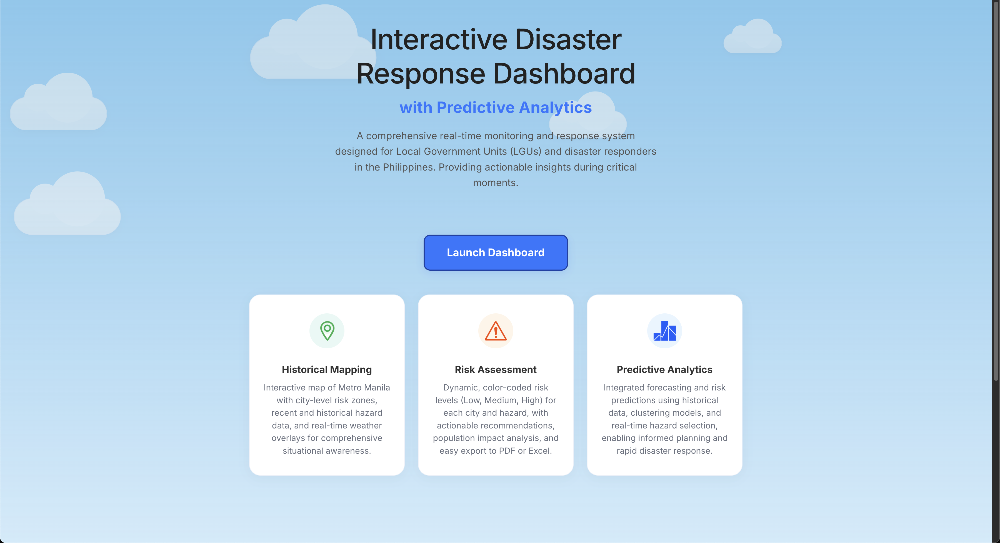
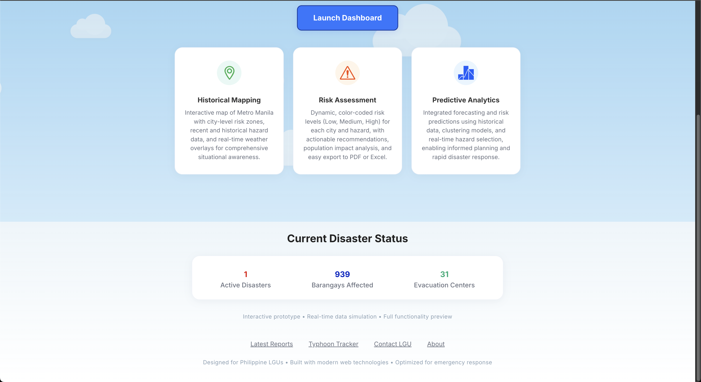
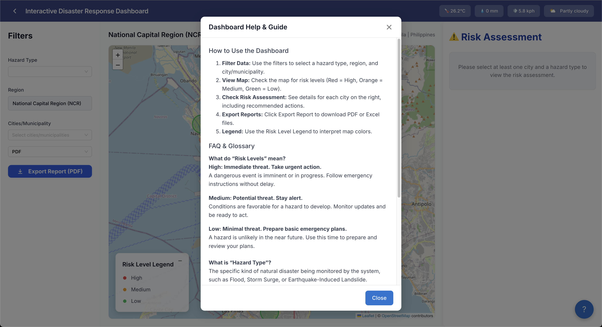

# Disaster Response Assistant with Predictive Analytics for Risk Management (NCR-Focused)

<a href="https://colab.research.google.com/github/moridin04/DisasterResponseAssistant/blob/main/DisasterResponseAssistant.ipynb" target="_parent">
  
</a>

**Google Colab Notebook:**  
The Colab badge above links to the original ML notebook, which demonstrates the predictive analytics and backend logic used in this project.

You can explore the data, models, and experiments in the notebook before running the production code here.

---

## Table of Contents

- [Disaster Response Assistant with Predictive Analytics for Risk Management (NCR-Focused)](#disaster-response-assistant-with-predictive-analytics-for-risk-management-ncr-focused)
  - [Table of Contents](#table-of-contents)
  - [Description](#description)
    - [Limitations](#limitations)
    - [Future Improvements](#future-improvements)
  - [Features](#features)
  - [Screenshots](#screenshots)
  - [Tech Stack](#tech-stack)
  - [Installation](#installation)
    - [Prerequisites](#prerequisites)
    - [Quick Start](#quick-start)
  - [Backend Setup](#backend-setup)
  - [Frontend Setup (in a new terminal)](#frontend-setup-in-a-new-terminal)
  - [Access the App](#access-the-app)
  - [Usage](#usage)
  - [API Endpoints](#api-endpoints)
    - [`GET /api/risk-data`](#get-apirisk-data)
    - [`GET /api/export_excel`](#get-apiexport_excel)
    - [`GET /api/export_pdf`](#get-apiexport_pdf)
  - [References](#references)

---

## Description

Disaster risk management is crucial for public safety, especially in disaster-prone regions like the Philippines. This project specifically focuses on the National Capital Region (NCR), providing local government units (LGUs), emergency responders, and researchers with a web-based assistant that leverages machine learning to predict and visualize risk zones for hazards such as floods, typhoons, and earthquakes within NCR.

Unlike traditional monitoring tools, this assistant emphasizes predictive analytics—classifying areas into high, medium, or low risk using historical data and clustering algorithms. The system features an interactive map dashboard, safety recommendations, and exportable reports to support proactive disaster planning and resource allocation.

### Limitations
Currently, the project is limited to NCR and may not cover all hazard types or provide real-time data for every location. Some features and data integrations are still in development.

### Future Improvements
Expansion to other regions, inclusion of additional hazard types, and enhanced real-time data integration are planned for future releases.

---

## Features

- **Data Integration:** Import historical disaster data from reliable sources (e.g., PAGASA, PHIVOLCS, Project NOAH), and real-time weather data from [WeatherAPI.com](https://www.weatherapi.com/).
- **Predictive Risk Analysis:** Classify geographic areas into risk categories using machine learning models.
- **Interactive Map Dashboard:** Visualize risk zones with color-coded maps and hazard overlays.
- **Safety Recommendations:** Generate tailored guidelines and alerts based on predicted risk levels.
- **Report Generation:** Export risk summaries and planning reports to PDF/Excel.
- **User-Friendly Interface:** Responsive web app for LGUs, responders, and researchers.

---

## Screenshots


<details>
  <summary>Home / Landing Page</summary>
  
  <br>
  <em>App introduction and feature highlights.</em>
</details>
<br>
<details>
  <summary>Disaster Status Overview</summary>
  
  <br>
  <em>Current disaster statistics and quick links.</em>
</details>
<br>
<details>
  <summary>Dashboard Main View</summary>
  
  <br>
  <em>Map-based risk zones, filters, and risk assessment cards.</em>
</details>
<br>
<details>
  <summary>FAQ & Help Guide</summary>
  
  <br>
  <em>Quick onboarding and glossary for new users.</em>
</details>
<br>

---

## Tech Stack

**Frontend:**
- React (Vite)
- Ant Design (UI library)
- Leaflet.js (Map visualization)
- CSS

**Backend:**
- Python (Flask)
- Machine Learning: scikit-learn, pandas, NumPy
- Data Storage: CSV
- Report Generation: FPDF (PDF), pandas (Excel)
- CORS for frontend-backend communication
- WeatherAPI.com (Real-time weather data integration)

**Other Tools:**
- Git (Version Control)
- VS Code (IDE)
- Google Colab (prototype & notebook)
- Openpyxl (Excel export)
- Figma (Design)

---

## Installation

### Prerequisites

- [Node.js](https://nodejs.org/) & npm
- [Python 3.x](https://www.python.org/)

---

### Quick Start

```bash
# Clone the repository
git clone https://github.com/gabcsx/CCSFEN1L.git
cd CCSFEN1L
```

## Backend Setup
```bash
cd backend
python -m venv venv
source venv/bin/activate  # On Windows: venv\Scripts\activate
pip install -r requirements.txt
python app.py
```

## Frontend Setup (in a new terminal)
```bash
cd frontend
npm install
npm run dev
```

## Access the App

- **Frontend:** [http://localhost:5173](http://localhost:5173)
- **Backend:** [http://localhost:5000](http://localhost:5000) (or your Flask port)

---

## Usage

- View risk zones on the interactive map dashboard.
- Get safety recommendations and alerts for selected areas.
- Export reports for disaster planning and documentation.


---

## API Endpoints

The backend exposes several endpoints for risk data and report export:

### `GET /api/risk-data`
- **Params:** `city` (optional, comma-separated), `hazard` (optional)
- **Returns:** JSON array of risk data for selected cities/hazards.

### `GET /api/export_excel`
- **Params:** `city` (optional, comma-separated)
- **Returns:** Excel file (`Risk_Report.xlsx`) for selected cities.

### `GET /api/export_pdf`
- **Params:** `city` (optional, comma-separated)
- **Returns:** PDF file (`Risk_Report.pdf`) for selected cities.

**Example usage:**
```bash
curl "http://localhost:5000/api/risk-data?city=Manila"
```
## References

- [PAGASA](https://www.pagasa.dost.gov.ph/)
- [PHIVOLCS](https://www.phivolcs.dost.gov.ph/)
- [Project NOAH](https://noah.up.edu.ph/)
- [HazardHunterPH](https://hazardhunter.georisk.gov.ph/)
- [WeatherAPI.com] (https://www.weatherapi.com/)
- [Scikit-learn](https://scikit-learn.org/stable/)
- [Leaflet.js](https://leafletjs.com/)
- [Ant Design](https://ant.design/)
- [FPDF](https://pyfpdf.github.io/)
- [Openpyxl](https://openpyxl.readthedocs.io/en/stable/)
- [Google Colab Notebook](https://colab.research.google.com/github/moridin04/DisasterResponseAssistant/blob/main/DisasterResponseAssistant.ipynb)
